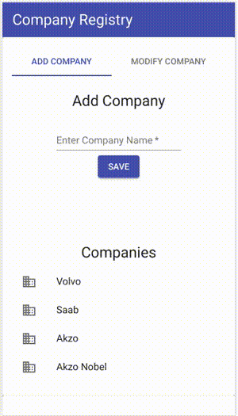

## Company Registry
### 2018-11-25
## Installation

#### Clone repo
``` 
git clone https://github.com/Rinbo/company-registry-react.git 
cd company-registry-react
```
#### Install dependencies
``` npm install ```
#### Start development server
``` npm start ```

## Features
- Create a company entry
- Modify or delete a company entry
- Create a person entry and associate that person with an available company
- Modify or delete a person
- List employees of a particular company with option to remove them from that company 
- List all people assigned to companies
- List all people no assigned to companies with option to assign them to a company
- Fully responsive design including swiping gestures on a mobile device

- 

## Storage
- Entered data is stored in browser local storage

## Link to live site:
- https://rinbo.github.io/company-registry-react/
